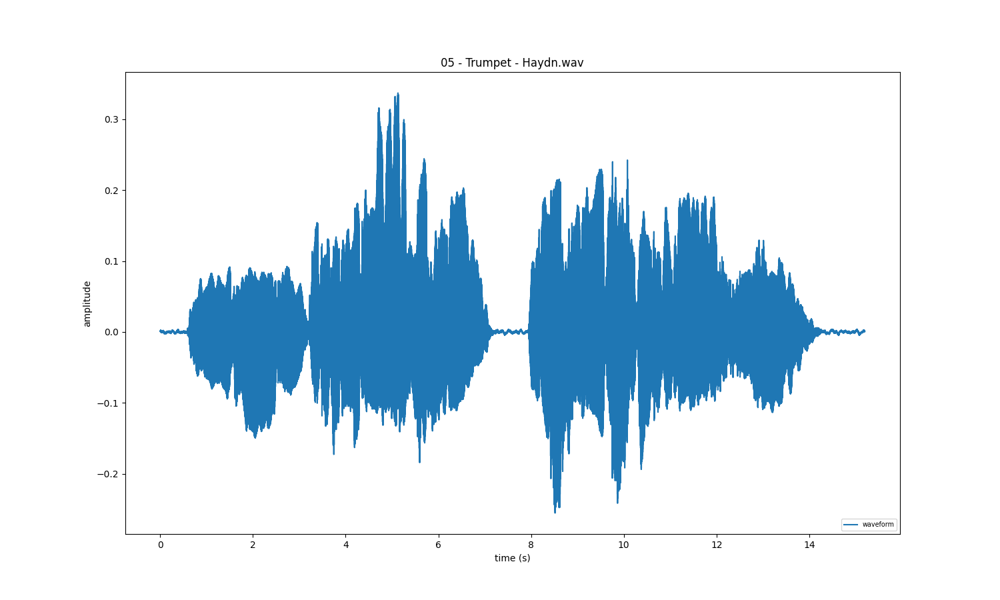
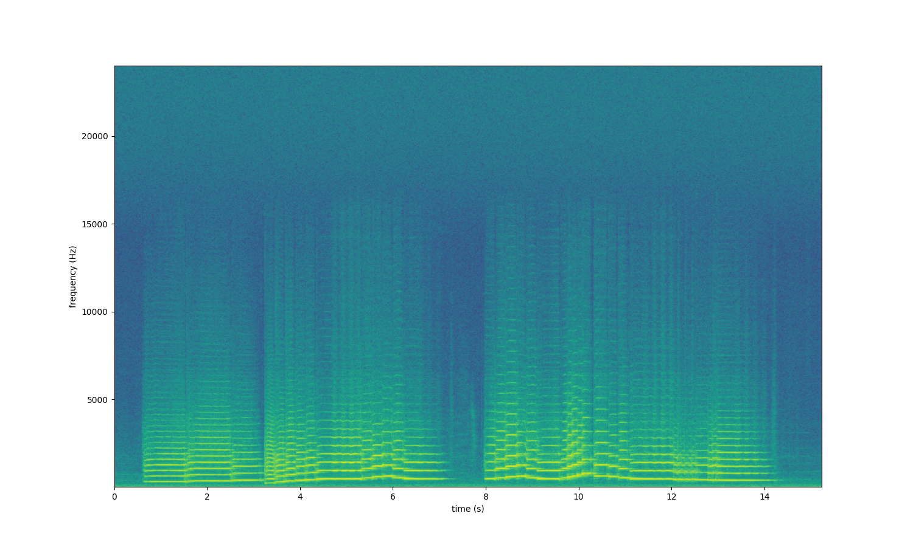
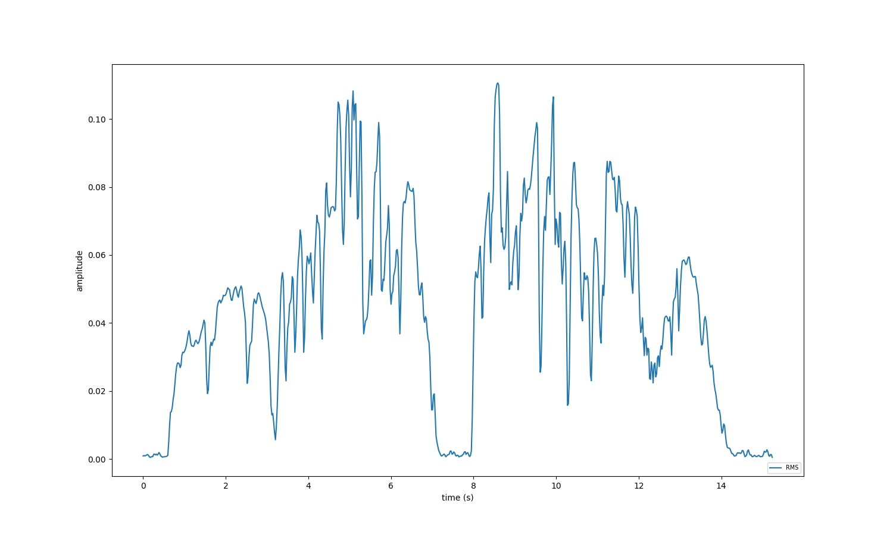
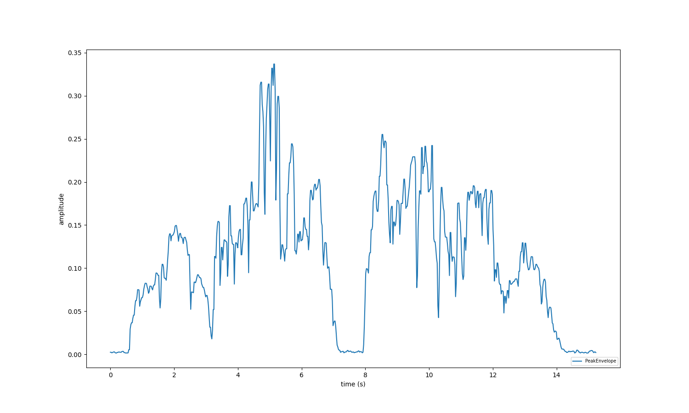

========
Tutorial
========

This tutorial aims to introduce the basics of *iracema*'s architecture_ and usage_.

.. _architecture:

------------
Architecture
------------

This section will discuss some import aspects of *iracema*’s architecture and offer an overview of the elements that compose the core functionalities of the library.

*iracema* relies on the manipulation of dynamic data, i.e., data that represent an attribute’s changes over time. Thus, *time series* is a fundamental element in *iracema*’s architecture.

The starting point for any task performed by it is the *audio time series*, from which other kinds of time-related data will be extracted. *iracema* applies transformations of time series into other time series, which can also be called a *feature extraction*. The implementation of such extractors depends on some recurrent types of operations, like applying sliding windows to a series of data. In Iracema, these operations are called *aggregation* methods.

To deal with a specific excerpt of a time series, such as a musical phrase or even a note. There is another important element in the architecture, called *segment*, which is used to delimit such excerpts. A user can specify the limits for a segment within the *time series* if he is already aware of its beginning and end; however, most of the time, users will expect the system to identify such limits by itself, a common kind of task in audio content extraction, known as *segmentation*.

Elements, like audio, time series and segments have been implemented as **classes**, since they have intrinsic data and behaviour. The following figure shows those classes in a diagram. The **Audio** class inherits the functionalities from **TimeSeries**, and add some specific behaviours (such as loading wave files). **Segments** provide a handy way to extract corresponding excerpts from time series of different sampling rates, since it performs all the necessary index conversion operations to extract data that coincide with the same time interval.

 .. figure:: ../img/classes.png
    :alt: classes
    :width: 50%

    Figure 1. Diagram showing the core classes of *iracema*

Other elements have been implemented as methods that take objects of those classes as input and output another object. For example, the method *fft* takes as input an *audio* object, a *window_size*, and a *hop_size*, and generates a time series in which each sample contains all the bins of the FFT for the interval corresponding to *hop_size*. Another example, the method *spectral_flux* will take a time series containing the result of an FFT operation as input and generate another time series containing the calculated spectral flux. The following figure shows a diagram that illustrates the typical workflow for performing basic feature extraction from audio files.

 .. figure:: ../img/workflow.png
    :alt: workflow
    :width: 50%

    Figure 2. Extracting features from an audio file

Segmentation  methods  will  usually  take *time_series* objects as input to output a list of segments, as shown in the next figure. 

 .. figure:: ../img/segmentation.png
    :alt: extract segments from a time series
    :width: 50%

    Figure 3. Extracting segments from time series

Then, these segments can be used to easily extract excerpts from time series objects (Figure 4),using square brackets (the same operator used in Pythonto perform indexing/slicing operations).

 .. figure:: ../img/slice_time_series.png
    :alt: slice a time series
    :width: 50%

    Figure 4. Using a segment to slice a time series

Modules
=======

These are the modules that compose iracema, and their respective functionalities:

- timeseries: contains the definition of the classesTimeSeriesandAudio.
- segment:  contains the definition of the classesSegmentandSegmentList.
- spectral: contains methods for frequency domain analysis (currently the FFT);
- pitch: a few different models for pitch detection.
- harmonics: a model for extracting harmonic components from audio.
- features: contains methods with the implementation of several classic feature extractors.
- segmentation: methods for automatic audio segmentation.
- plot: contains several different methods for plotting time series data.
- aggregation: contains some common aggregation methods that can be useful for implementing feature extractors.
- io:  subpackage containing IO methods, for loading/writing files, playing audio, etc.
- util: subpackage containing some useful modules for unit conversion, DSP, windowing operations, etc.

For more information, please read our article_ on SBCM's 2019 Proceedings. 

.. _article: https://compmus.ime.usp.br/sbcm/2019/papers/sbcm-2019-3.pdf

.. _usage:

-----
Usage
-----

This section will present a quickstart guide to programming with *iracema*.

Loading audio files
-------------------

.. code:: python

  import iracema
  audio = iracema.Audio("00 - Flute - Iracema.wav")

Loading audio files in Iracema is pretty straightforward, and the only thing that must be specified
is a string containing the path to the audio file that should be loaded.

Playing the loaded audio and plotting a waveform is actually pretty simple to, and can be done with:

.. code:: python
  
  # play audio
  audio.play()

  # plot waveform
  audio.plot()

   Figure 5. Waveform plot of the audio file

Calculating basic features
--------------------------

As most features will need a FFT as input, the second step should be calculating it for the audio
you've just loaded. For being able to do it, you must specify the sliding window and hop size 
values (in samples).
After calculating the FFT you're now able to plot a spectogram!

Other useful methods are RMS and Peak Envelope, which will be extracted and plotted in the example.

.. code:: python

  # specifying window and hop sizes
  window, hop = 2048, 1024
  
  # calculating the FFT
  fft = iracema.spectral.fft(audio, window, hop)
  
  # plotting the spectrogram
  iracema.plot.plot_spectrogram(fft)
  
  # calculating the RMS
  rms = iracema.features.rms(audio, window, hop)
  
  # plotting the RMS
  rms.plot()

  # calculating the Peak Envelope
  peak = iracema.features.peak_envelope(audio, window, hop)

  # plotting the Peak Envelope
  peak.plot()

   Figure 6. Spectrogram plot of the audio file

   Figure 7. RMS plot of the audio file

   Figure 7. Peak envelope plot of the audio file

Extracting pitch and harmonics
------------------------------

Another important step is to extract pitch. One possible way of doing it is using the Harmonic
Product Spectrum method. But you can check other methods in the *pitch* module.
Now you can extract the harmonics, as it's dependent on a pitch method. Iracema already has a 
bulit-in function for plotting the harmonics over the spectrogram.
Notice that the harmonics methods return a dictionary, with it's keys corresponding to three TimeSeries objetcs: 'frequency', 'magnitude' and 'phase'.

.. code:: python
  
  # extract pitch
  hps_pitch = iracema.pitch.hps(fft, minf0=1, maxf0=1000)

  #extract harmonics
  harmonics = iracema.harmonics.extract(fft, hps_pitch)
  
  #plot harmonics over spectrogram
  iracema.plot.plot_audio_spectrogram_harmonics(
  audio, rms, peak, fft, pitch, harmonics['frequency'], fftlim=(0, 15000))

.. figure:: ./harmonics_spectrogram.png
   :alt: Harmonics plotted over the spectrogram
   :width: 100%

   Figure 8. Harmonics plotted over the spectrogram
